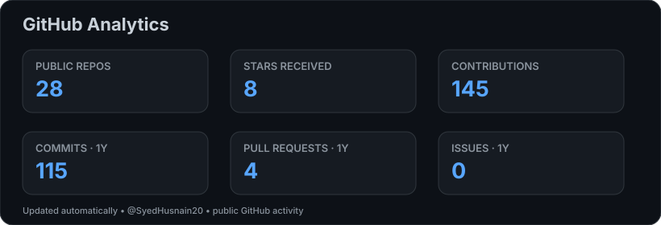
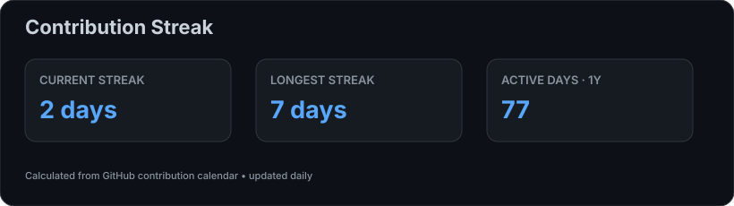
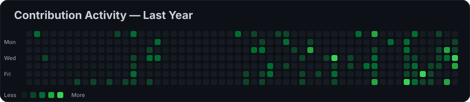
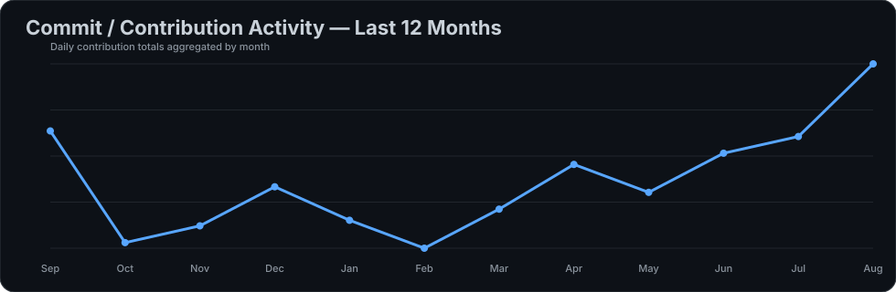

<h1 align="center">Hi 👋, I'm Hasnain Zainulabdin</h1>

<h3 align="center">
Python Developer • AI/ML Engineer • AI Integration • Backend Developer
</h3>

  
  
  

---

## 👨‍💻 About Me

I'm **Hasnain Zainulabdin**, a Python Developer and AI/ML Engineer from **Hyderabad, Pakistan**, focused on building practical software, AI-powered applications, automation systems, and intelligent backend solutions.

- 🔭 Currently working on **[FeeTrack](https://github.com/SyedHusnain20/Fee_Track)**
- 🌱 Currently learning **Agentic AI & Cloud Computing**
- 🤖 Interested in **AI Agents, RAG, LLMs, Chatbots & AI Integration**
- ⚡ Strong focus on **Python & Backend Development**
- 💬 Ask me about **Python, AI, FastAPI, Chatbots & Automation**
- 🌐 Portfolio: **[hasnainzainulabdin.vercel.app](https://hasnainzainulabdin.vercel.app/)**
- 📫 Email: **[hasnainzainulabdin@gmail.com](mailto:hasnainzainulabdin@gmail.com)**

> ⚡ Fun fact: I completed my Final Year Thesis report the night before the submission deadline. 😅

---

# 🚀 Featured Projects

<table>
<tr>
<td width="50%">

### 🕌 ShariahEase

AI-powered Islamic finance and Shariah compliance assistant.

**Highlights:** RAG • Conversational AI • WhatsApp Bot • Zakat Calculator • Document Search

**Tech:** Python • FastAPI • FAISS • Llama 3 • Hugging Face

</td>

<td width="50%">

### ⚖️ QanoonDaan

AI-powered legal information assistant focused on making legal information easier to access.

**Focus:** AI • NLP • LegalTech • RAG

</td>
</tr>

<tr>
<td width="50%">

### 🐔 Chicken Khata

Desktop accounting and ledger management system for a chicken shop.

**Features:** Supplier Management • Customer Khata • Daily Ledger • Purchases • Payments • Expenses • Invoices

**Tech:** Electron • SQLite

</td>

<td width="50%">

### 🎓 FeeTrack

Fee management system for student fee cycles, payments and financial records.

**Focus:** Student Management • Fee Cycles • Payments • Reporting

</td>
</tr>
</table>

---

# 📊 GitHub Analytics

  

# 🔥 Contribution Streak

  

# 📈 Contribution Activity

  

# 📊 Commit Activity

  

---

# 🛠️ Languages & Tools

---

# 🤝 Connect With Me

---

<b>⭐ If you find my projects useful, consider giving them a star!</b>

<i>Building with Python, AI & curiosity 🚀</i>

